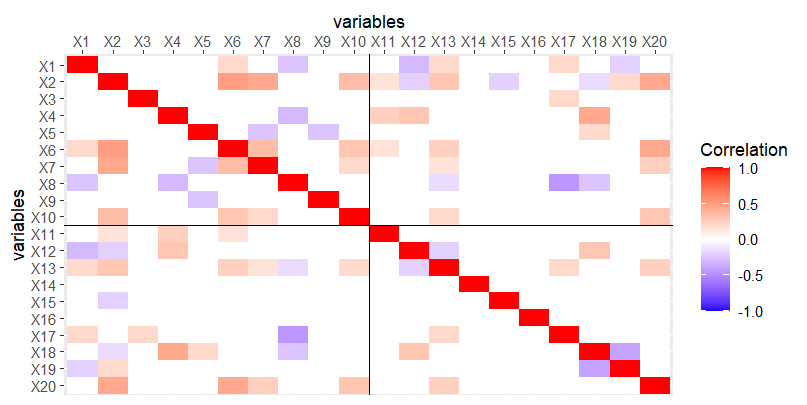

# Simulation design

Here we briefly describe our simulation design. More details can be found in the manuscript and the <a href="https://journals.plos.org/plosone/article?id=10.1371/journal.pone.0308543" target="_blank">study protocol</a>.

## Aim

We aimed to compare different variable selection methods for multivariable linear or logistic regression in the context of descriptive modeling.

## Data generating mechanisms

**Simulation of independent variables**

-   20 independent variables $X_1,\ldots,X_{20}$ (10 true predictors and 10 noise variables)

-   Correlation structure and distributions of the variables were based on data from the National Health and Nutrition Examination Survey (NHANES)

    

**Simulation of outcome Y**

-   Standardized beta coefficients of predictors were chosen to obtain mixture of stronger and weaker effects.

-   For **linear regression**: outcomes were calculated as $Y = x \beta + \epsilon$, with $\epsilon \sim N(0,\sigma^2)$, and $\sigma^2$ chosen such that $R^2 = 0.45$ (strong signal) or $R^2 = 0.15$ (weak signal).

-   For **logistic regression**: outcomes Y were drawn from a Bernoulli distribution with event probability $\frac{1}{1+\exp(-c x \beta)},$ with a constant $c > 0$. We adjusted $c$ and the intercept $\beta_0$ to obtain different event rates (0.3 and 0.05) and Cox-Snell $R_{CS}^2$ values (strong or weak signal).

**Simulation settings**

<table class="simtbl">
<thead>
<tr>
  <th></th>
  <th>Linear regression</th>
  <th>Logistic regression event rate 0.3</th>
  <th>Logistic regression event rate 0.05</th>
</tr>
</thead>
<tbody>
<tr>
  <td>Strong signal strength</td>
  <td><em>R</em>2 = 0.45</td>
  <td><em>R</em>2CS = 0.40</td>
  <td><em>R</em>2CS = 0.16</td>
</tr>
<tr>
  <td>Weak signal strength</td>
  <td><em>R</em>2 = 0.15</td>
  <td><em>R</em>2CS = 0.13</td>
  <td><em>R</em>2CS = 0.05</td>
</tr>
</tbody>
</table>

**Sample sizes and events-per-variable (EPV) values**

<table class="simgrid">
<tbody>
<tr>
  <td rowspan="2" class="rowhdr">linear regression</td>
  <td class="italic">n</td>
  <td>100</td><td>200</td><td>400</td><td class="italic">500</td>
  <td>800</td><td>1600</td><td>3200</td><td>6400</td>
</tr>
<tr>
  <td>EPV</td>
  <td>5</td><td>10</td><td>20</td><td class="italic">25</td>
  <td>40</td><td>80</td><td>160</td><td>320</td>
</tr>
<tr>
  <td rowspan="2" class="rowhdr">logistic regression, event rate 0.3</td>
  <td class="italic">n</td>
  <td>183</td><td>365</td><td>730</td><td class="italic">1,667</td>
  <td>1461</td><td>2922</td><td>5844</td><td>11,687</td>
</tr>
<tr>
  <td>EPV</td>
  <td>2.75</td><td>5.48</td><td>10.95</td><td class="italic">25</td>
  <td>21.92</td><td>43.83</td><td>87.66</td><td>175.31</td>
</tr>
<tr>
  <td rowspan="2" class="rowhdr">logistic regression, event rate 0.05</td>
  <td class="italic">n</td>
  <td>2000</td><td>4000</td><td>8000</td><td class="italic">10,000</td>
  <td>&mdash;</td><td>&mdash;</td><td>&mdash;</td><td>&mdash;</td>
</tr>
<tr>
  <td>EPV</td>
  <td>5</td><td>10</td><td>20</td><td class="italic">25</td>
  <td>&mdash;</td><td>&mdash;</td><td>&mdash;</td><td>&mdash;</td>
</tr>
</tbody>
</table>

## Estimands and targets

-   true regression coefficients of the data-generating models

-   model selection (e.g., whether the true model is selected)

## Methods

-   **BE(BIC), BE(0.05), BE(AIC), BE(0.5)**: Backward elimination with BIC, with $\alpha = 0.05$, with AIC, or with $\alpha = 0.5$

-   **ABE(AIC)**: Augmented backward elimination with AIC and $\tau = 0.05$

-   **FSel(AIC)**: Forward selection with AIC

-   **Step_FSel(AIC)**: Stepwise forward selection with AIC (i.e., forward selection with backward elimination steps)

-   **Lasso(CV)**: Lasso with complexity parameter $\lambda$ tuned with 10-fold cross-validation

-   **RLasso(CV)**: Relaxed Lasso with complexity parameter $\lambda$ tuned with 10-fold cross-validation

-   **RLasso(BIC)**: Relaxed Lasso with complexity parameter $\lambda$ tuned with BIC

-   **AdaLasso(CV)**: Adaptive Lasso with complexity parameter $\lambda$ tuned with 10-fold cross-validation

We also considered the global model with all variables ("full model", FU).

## Performance measures

-   Bias of estimated regression coefficients, calculated unconditionally or conditional on selection. To compute unconditional bias, the regression coefficient of a non-selected variable was set to 0. To compute conditional bias, only simulation repetitions were taken into account in which that variable was selected.

-   True positive rate (selection rates of true predictors) and false positive rate (selection rates of noise variables)

-   Selection rate of the true model, any over-selection model or any under-selection model (true model: consists exactly of the ten predictors, over-selection model: includes all predictors as well as at least one noise variable, under-selection model: does not contain all predictors but possibly includes noise variables)

**Additional measure**

-   Model size: number of selected variables

Results were averaged over 2000 simulation repetitions.
